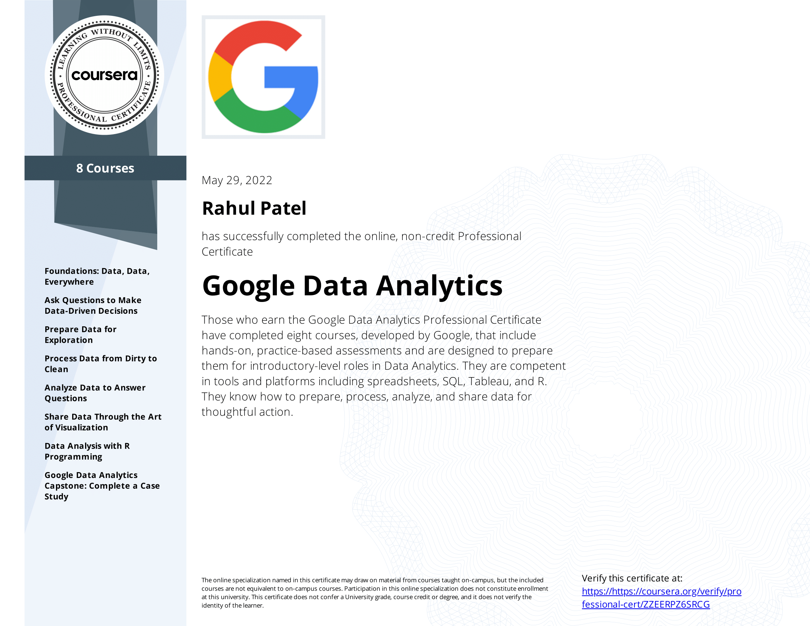

## [Google Data Analytics Professional Certificate](https://www.coursera.org/professional-certificates/google-data-analytics)

&nbsp;

## A case study on the cyclistic bike-share Analysis
This repository contains an analysis done for the capstone project of the Google Data Analytics Professional Certificate course offered on Coursera. In this case study, I used data from a fictional bike rental company based in Chicago, Cyclist, to try to determine and understand the main differences between annual members and casual rider. With such insights, I was able to deliver recommendations, with which the company has developed a marketing campaign aimed at converting casual riders to annual members, and hence maximizing the growth of the company.

